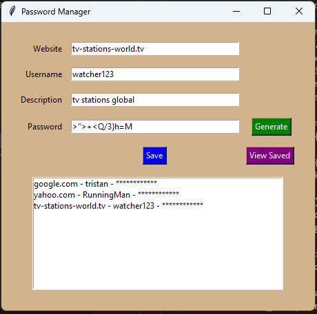
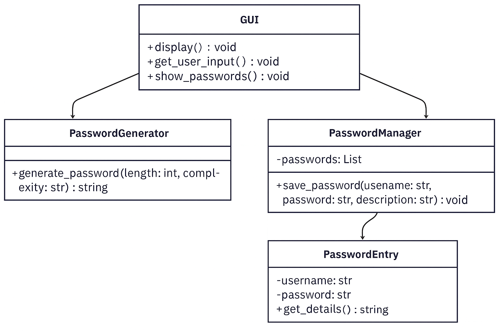

# 🔐 Password Manager with Generator

A simple GUI-based password manager built with Python. It includes:
- Secure password generator
- Password storage (locally in JSON)
- Basic search and listing interface

---

## 🧩 Features

- Generate secure passwords
- Store passwords with website, username, and notes
- Save/load from local file
- GUI built with `tkinter`

---

## 🚀 Installation

1. Clone the repo:

git clone https://github.com/OnePieceExsists/password_manager.git
cd password-manager

# Install requirements(Optional):

python -m venv venv
.\venv\Scripts\Activate.ps1
# source venv/bin/activate (Linux, macOS)

# Run the app:

python main.py

# Testing
*Unit tests for password generation and data storage:

python -m unittest discover tests/

# Project Structure

password_manager/
│
├── main.py
├── password_generator.py
├── password_manager.py
├── gui.py
├── storage.json          # file to store passwords
├── LICENSE               # license file with Apache-2.0 text
├── README.md
└── tests/
    ├── test_password_generator.py
    └── test_password_manager.py

# 🖥️ Screenshots

# 🔐 Security Notes
Passwords are stored in plain JSON, without encryption.

For real-world use, consider:

Master password or login

Encryption (e.g., using Fernet / AES)

Secure storage (e.g., encrypted database or keyring)

# 📘 UML Class Diagram

This UML class diagram shows the structural design of the Password Manager application. It defines four core components:

-GUI: Manages the user interface, event handling, and user interactions. It connects with the generator and manager classes to handle password creation and storage.

-PasswordGenerator: Responsible for generating secure passwords based on specified criteria (length, complexity, etc.).

-PasswordEntry: Represents a single password record, including website, username, password, and description. This class helps organize and format stored data.

-PasswordManager: Handles the saving, loading, and storage of password entries. It manages a collection of PasswordEntry objects and interacts with file storage (or memory, depending on your implementation).

This architecture ensures a clean separation of responsibilities and improves maintainability, testing, and extensibility.

# 📌 Requirements
Python 3.8+

Tkinter (usually preinstalled)

# ✅ To-Do / Future Features
 Add master password / login ✅

 Encrypt stored passwords ✅

 Add password strength indicator

 Export/import entries

 Cross-platform packaging (e.g., EXE with PyInstaller)

# 📄 License
This project is licensed under the Apache License 2.0.
You may use, modify, and distribute it in compliance with the Apache 2.0 License.
